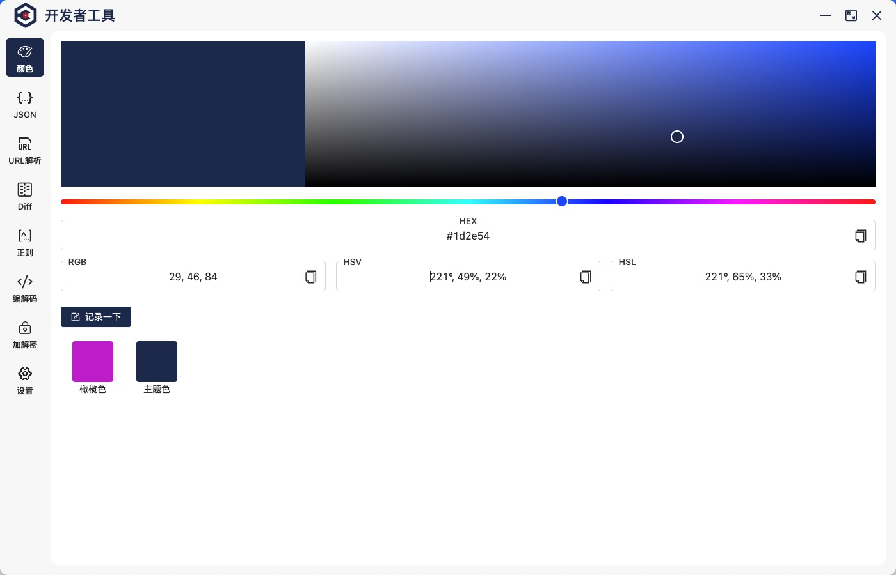
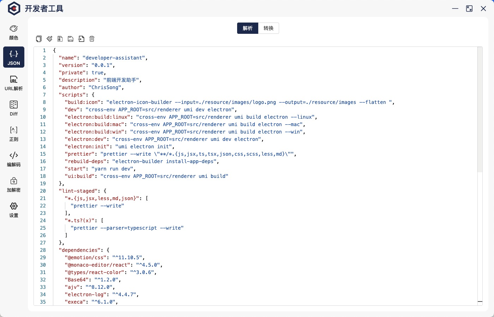

# developer-assistant

开发者助手是一个开发工具集客户端，包含了常用的 json 解析处理、颜色拾取转换、编码、文本 diff 等操作

## 截图

<p align="center">
 

</p>

## 功能列表

- [x] 颜色拾取和转换
- [x] json 处理（需要增加颜色记录功能）
- [x] 正则工具
- [ ] 密钥生成
  - [ ] 对称加解密
  - [ ] 非对称加解密
  - [x] hash 加密
- [x] 编码转换
- [ ] 图片处理
- [ ] 简单接口请求
- [x] diff 文本
- [ ] 文件压缩
- [ ] 代码执行 vm

## setup

### install

```sh
cd developer-assistant
yarn
```

### start

```sh
yarn run dev
```

### build

```sh
yarn run electron:build:mac  # for mac
```
