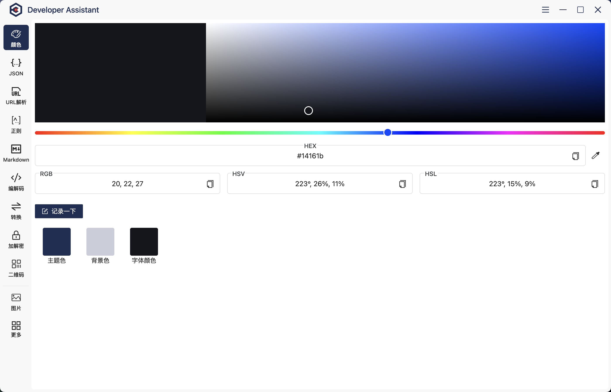
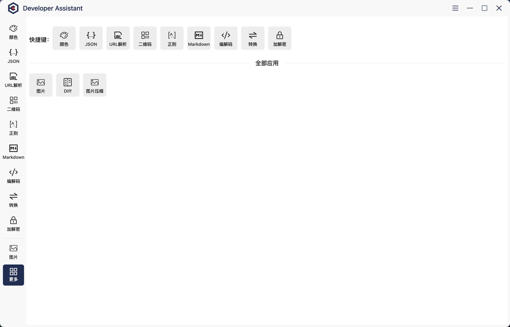

  

<h1 align="center">Developer Assistant</h1>

开发者助手是一个开发工具集客户端，包含了常用的 Json 解析处理、颜色拾取转换、编码、文本 Diff 等操作。

 
 

## 功能列表

- [x] 颜色拾取和转换
- [x] Json 处理
- [x] 正则工具
- [x] 编码转换:url、base64
- [x] diff 文本
- [x] 图片压缩、编辑、转码
- [x] 二维码生成、解码
- [x] Url 解析
- [x] Markdown 编辑器
- [ ] 文本转换
- [ ] 密钥工具
