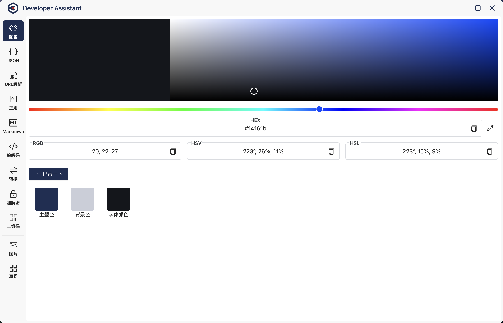
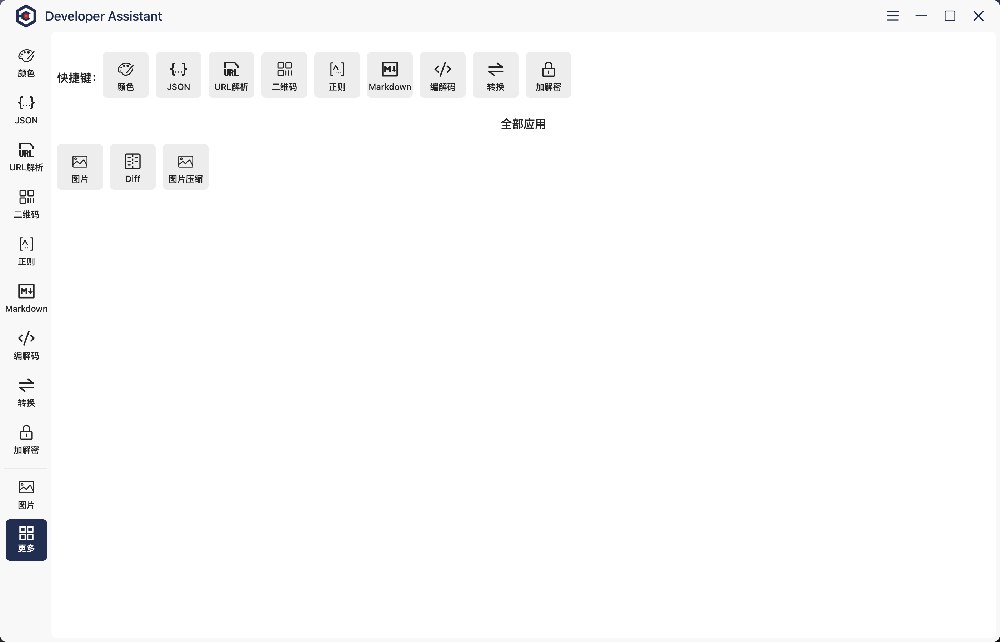

  

<h1 align="center">Developer Assistant</h1>

开发者助手是一个开发工具集客户端，包含了常用的 Json 解析处理、颜色拾取转换、编码、文本 Diff 等工具。<a href="https://chrissong1994.github.io/developer-assistant/" target="blank">查看主页</a>

 
 

## MIT License
