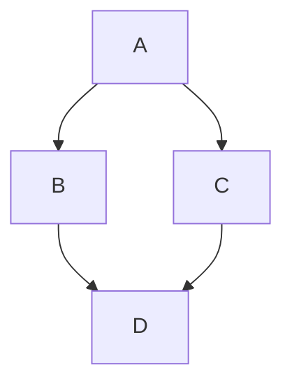

## Markdown 基础语法

我就是喜欢**粗体文本**。斜体文本真是*太棒了*。在命令提示符下，输入 `nano`。

我最喜欢的 markdown 编辑器是 [ByteMD](https://github.com/bytedance/bytemd)。

1. 第一项
2. 第二项
3. 第三项

> 多萝西跟着她穿过城堡里许多美丽的房间。

```js
import gfm from '@bytemd/plugin-gfm';
import { Editor, Viewer } from 'bytemd';

const plugins = [
  gfm(),
  // 在这里添加更多插件
];

const editor = new Editor({
  target: document.body, // 要渲染的 DOM
  props: {
    value: '',
    plugins,
  },
});

editor.on('change', (e) => {
  editor.$set({ value: e.detail.value });
});
```

## GFM 扩展语法

自动 URL 链接：https://github.com/bytedance/bytemd

~~世界是平的。~~ 我们现在知道世界是圆的。

- [x] 撰写新闻稿
- [ ] 更新网站
- [ ] 联系媒体

| 语法 | 描述 |
| ---- | ---- |
| 标题 | 题目 |
| 段落 | 文本 |

## 脚注

这是一个简单的脚注，[^1] 这是一个更长的脚注。[^bignote]

[^1]: 这是第一个脚注。
[^bignote]: 这是一个包含多个段落和代码的脚注。

    缩进段落以将它们包含在脚注中。

    `{ my code }`

    添加任意数量的段落。

## 表情符号

点赞：:+1:，点踩：:-1:。

家庭：:family_man_man_boy_boy:

长旗帜：:wales:，:scotland:，:england:。

## 数学公式

行内数学公式：$a+b$

$$
\displaystyle \left( \sum_{k=1}^n a_k b_k \right)^2 \leq \left( \sum_{k=1}^n a_k^2 \right) \left( \sum_{k=1}^n b_k^2 \right)
$$

## Mermaid 图表


